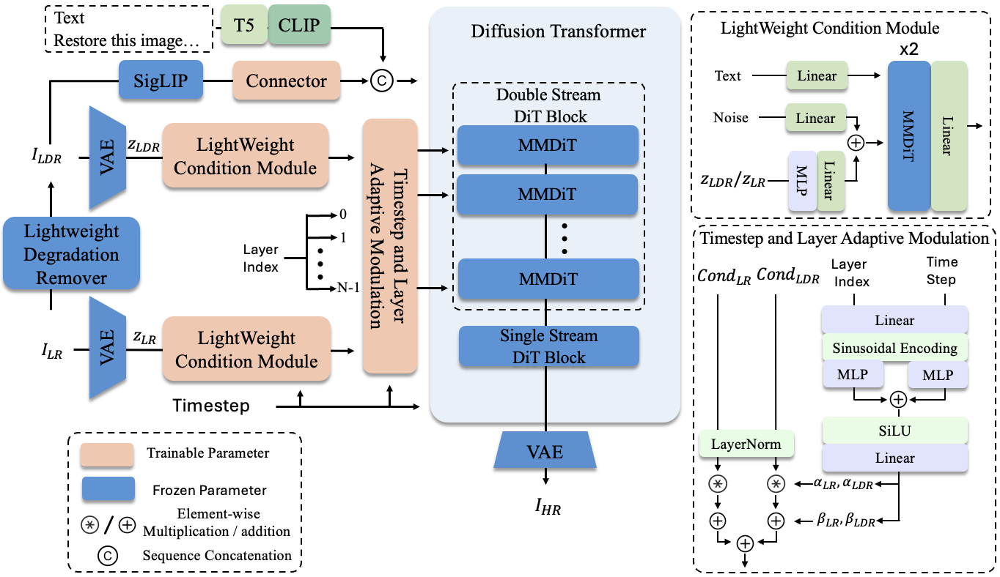

<div align="center">
<h1>🎨 LucidFlux:<br/>Caption-Free Universal Image Restoration with a Large-Scale Diffusion Transformer</h1>

<!-- [](https://github.com/W2GenAI-Lab/LucidFlux)
[](https://github.com/W2GenAI-Lab/LucidFlux)
[](https://github.com/W2GenAI-Lab/LucidFlux)
[](https://github.com/W2GenAI-Lab/LucidFlux)
[](https://github.com/W2GenAI-Lab/LucidFlux) -->

<!--  -->

### [**🌐 Website**](https://w2genai-lab.github.io/LucidFlux/) | [**📄 Technical Report**](Technical_Report.pdf) | [**🤗 Models**](https://huggingface.co/W2GenAI/LucidFlux) 
<!-- | [**🤗 HF Demo**](https://github.com/W2GenAI-Lab/LucidFlux) -->
<!-- [**🎯 Demo**](https://github.com/W2GenAI-Lab/LucidFlux)  -->
</div>

---


---
## News & Updates

---

Let us know if this works!

## 👥 Authors

> [**Song Fei**](https://github.com/FeiSong123)<sup>1</sup>\*, [**Tian Ye**](https://owen718.github.io/)<sup>1</sup>\*‡, [**Lei Zhu**](https://sites.google.com/site/indexlzhu/home)<sup>1,2</sup>†
>
> <sup>1</sup>The Hong Kong University of Science and Technology (Guangzhou)  
> <sup>2</sup>The Hong Kong University of Science and Technology  
>
> \*Equal Contribution, ‡Project Leader, †Corresponding Author

---

## 🌟 What is LucidFlux?

<!-- <div align="center">

<br>
</div> -->

LucidFlux is a framework designed to perform high-fidelity image restoration across a wide range of degradations without requiring textual captions. By combining a Flux-based DiT backbone with Light-weight Condition Module and SigLIP semantic alignment, LucidFlux enables caption-free guidance while preserving structural and semantic consistency, achieving superior restoration quality.

<!-- ## 🚀 Quick Start

### 🔧 Installation

```bash
# Clone the repository
git clone https://github.com/ephemeral182/LucidFlux.git
cd LucidFlux

# Create conda environment
conda create -n postercraft python=3.11
conda activate postercraft

# Install dependencies
pip install -r requirements.txt

``` -->

<!-- ### 🚀 Quick Generation

Generate high-quality aesthetic posters from your prompt with `BF16` precision:

```bash
python inference.py \
  --prompt "Urban Canvas Street Art Expo poster with bold graffiti-style lettering and dynamic colorful splashes" \
  --enable_recap \
  --num_inference_steps 28 \
  --guidance_scale 3.5 \
  --seed 42 \
  --pipeline_path "black-forest-labs/FLUX.1-dev" \
  --custom_transformer_path "LucidFlux/LucidFlux-v1_RL" \
  --qwen_model_path "Qwen/Qwen3-8B"
```

If you are running on a GPU with limited memory, you can use `inference_offload.py` to offload some components to the CPU:

```bash
python inference_offload.py \
  --prompt "Urban Canvas Street Art Expo poster with bold graffiti-style lettering and dynamic colorful splashes" \
  --enable_recap \
  --num_inference_steps 28 \
  --guidance_scale 3.5 \
  --seed 42 \
  --pipeline_path "black-forest-labs/FLUX.1-dev" \
  --custom_transformer_path "LucidFlux/LucidFlux-v1_RL" \
  --qwen_model_path "Qwen/Qwen3-8B"
``` -->
<!-- 
### 💻 Gradio Web UI

We provide a Gradio web UI for LucidFlux. 

```bash
python demo_gradio.py
``` -->


## 📊 Performance Benchmarks

<div align="center">

### 📈 Quantitative Results

<table>
<thead>
  <tr>
    <th>Benchmark</th>
    <th>Metric</th>
    <th>ResShift</th>
    <th>StableSR</th>
    <th>SinSR</th>
    <th>SeeSR</th>
    <th>DreamClear</th>
    <th>SUPIR</th>
    <th>LucidFlux<br/>(Ours)</th>
  </tr>
</thead>
<tbody>
  <tr>
    <td rowspan="7" style="text-align:center; vertical-align:middle;">RealSR</td>
    <td style="white-space: nowrap;">CLIP-IQA+ ↑</td>
    <td>0.5005</td>
    <td>0.4408</td>
    <td>0.5416</td>
    <td>0.6731</td>
    <td>0.5331</td>
    <td>0.5640</td>
    <td><b>0.7074</b></td>
  </tr>
  <tr>
    <td style="white-space: nowrap;">Q-Align ↑</td>
    <td>3.1045</td>
    <td>2.5087</td>
    <td>3.3615</td>
    <td>3.6073</td>
    <td>3.0044</td>
    <td>3.4682</td>
    <td><b>3.7555</b></td>
  </tr>
  <tr>
    <td style="white-space: nowrap;">MUSIQ ↑</td>
    <td>49.50</td>
    <td>39.98</td>
    <td>57.95</td>
    <td>67.57</td>
    <td>49.48</td>
    <td>55.68</td>
    <td><b>70.20</b></td>
  </tr>
  <tr>
    <td style="white-space: nowrap;">MANIQA ↑</td>
    <td>0.2976</td>
    <td>0.2356</td>
    <td>0.3753</td>
    <td>0.5087</td>
    <td>0.3092</td>
    <td>0.3426</td>
    <td><b>0.5437</b></td>
  </tr>
  <tr>
    <td style="white-space: nowrap;">NIMA ↑</td>
    <td>4.7026</td>
    <td>4.3639</td>
    <td>4.8282</td>
    <td>4.8957</td>
    <td>4.4948</td>
    <td>4.6401</td>
    <td><b>5.1072</b></td>
  </tr>
  <tr>
    <td style="white-space: nowrap;">CLIP-IQA ↑</td>
    <td>0.5283</td>
    <td>0.3521</td>
    <td>0.6601</td>
    <td><b>0.6993</b></td>
    <td>0.5390</td>
    <td>0.4857</td>
    <td>0.6783</td>
  </tr>
  <tr>
    <td style="white-space: nowrap;">NIQE ↓</td>
    <td>9.0674</td>
    <td>6.8733</td>
    <td>6.4682</td>
    <td>5.4594</td>
    <td>5.2873</td>
    <td>5.2819</td>
    <td><b>4.2893</b></td>
  </tr>
  <tr>
    <td rowspan="7" style="text-align:center; vertical-align:middle;">RealLQ250</td>
    <td style="white-space: nowrap;">CLIP-IQA+ ↑</td>
    <td>0.5529</td>
    <td>0.5804</td>
    <td>0.6054</td>
    <td>0.7034</td>
    <td>0.6810</td>
    <td>0.6532</td>
    <td><b>0.7406</b></td>
  </tr>
  <tr>
    <td style="white-space: nowrap;">Q-Align ↑</td>
    <td>3.6318</td>
    <td>3.5586</td>
    <td>3.7451</td>
    <td>4.1423</td>
    <td>4.0640</td>
    <td>4.1347</td>
    <td><b>4.3935</b></td>
  </tr>
  <tr>
    <td style="white-space: nowrap;">MUSIQ ↑</td>
    <td>59.50</td>
    <td>57.25</td>
    <td>65.45</td>
    <td>70.38</td>
    <td>67.08</td>
    <td>65.81</td>
    <td><b>73.01</b></td>
  </tr>
  <tr>
    <td style="white-space: nowrap;">MANIQA ↑</td>
    <td>0.3397</td>
    <td>0.2937</td>
    <td>0.4230</td>
    <td>0.4895</td>
    <td>0.4400</td>
    <td>0.3826</td>
    <td><b>0.5589</b></td>
  </tr>
  <tr>
    <td style="white-space: nowrap;">NIMA ↑</td>
    <td>5.0624</td>
    <td>5.0538</td>
    <td>5.2397</td>
    <td>5.3146</td>
    <td>5.2200</td>
    <td>5.0806</td>
    <td><b>5.4836</b></td>
  </tr>
  <tr>
    <td style="white-space: nowrap;">CLIP-IQA ↑</td>
    <td>0.6129</td>
    <td>0.5160</td>
    <td><b>0.7166</b></td>
    <td>0.7063</td>
    <td>0.6950</td>
    <td>0.5767</td>
    <td>0.7122</td>
  </tr>
  <tr>
    <td style="white-space: nowrap;">NIQE ↓</td>
    <td>6.6326</td>
    <td>4.6236</td>
    <td>5.4425</td>
    <td>4.4383</td>
    <td>3.8700</td>
    <td><b>3.6591</b></td>
    <td>3.6742</td>
  </tr>
</tbody>
</table>


<!--  -->

</div>

---

## 🎭 Gallery & Examples

<div align="center">

### 🎨 LucidFlux Gallery

---

### 🔍 Comparison with Open-Source Methods

<table>
<tr align="center">
    <td width="200"><b>LQ</b></td>
    <td width="200"><b>SinSR</b></td>
    <td width="200"><b>SeeSR</b></td>
    <td width="200"><b>SUPIR</b></td>
    <td width="200"><b>DreamClear</b></td>
    <td width="200"><b>Ours</b></td>
</tr>
<tr align="center"><td colspan="6"></td></tr>
<tr align="center"><td colspan="6"></td></tr>
<tr align="center"><td colspan="6"></td></tr>
<tr align="center"><td colspan="6"></td></tr>
<tr align="center"><td colspan="6"></td></tr>
</table>

<details>
<summary>Show more examples</summary>

<table>
<tr align="center"><td colspan="6"></td></tr>
<tr align="center"><td colspan="6"></td></tr>
<tr align="center"><td colspan="6"></td></tr>
<tr align="center"><td colspan="6"></td></tr>
<tr align="center"><td colspan="6"></td></tr>
</table>

</details>

---

### 💼 Comparison with Commercial Models

<table>
<tr align="center">
    <td width="200"><b>LQ</b></td>
    <td width="200"><b>HYPIR</b></td>
    <td width="200"><b>Topaz</b></td>
    <td width="200"><b>Gemini-Banana</b></td>
    <td width="200"><b>GPT-4o</b></td>
    <td width="200"><b>Ours</b></td>
</tr>
<tr align="center"><td colspan="6"></td></tr>
<tr align="center"><td colspan="6"></td></tr>
<tr align="center"><td colspan="6"></td></tr>
<tr align="center"><td colspan="6"></td></tr>
</table>

<details>
<summary>Show more examples</summary>

<table>
<tr align="center"><td colspan="6"></td></tr>
<tr align="center"><td colspan="6"></td></tr>
<tr align="center"><td colspan="6"></td></tr>
<tr align="center"><td colspan="6"></td></tr>
</table>

</details>
</div>

---

## 🏗️ Model Architecture

<div align="center">

<br>
<em><strong>Caption-Free Universal Image Restoration with a Large-Scale Diffusion Transformer</strong></em>
</div>

Our unified framework consists of **four critical components in the training workflow**:

**🔤 Scaling Up Real-world High-Quality Data for Universal Image Restoration**

**🎨 Two Parallel Light-weight Condition Module Branches for Low-Quality Image Conditioning**

**🎯 Timestep and Layer-Adaptive Condition Injection**

**🔄 Semantic Priors from Siglip for Caption-Free Semantic Alignment**


## 🚀 Quick Start

### 🔧 Installation

```bash
# Clone the repository
git clone https://github.com/W2GenAI-Lab/LucidFlux.git
cd LucidFlux

# Create conda environment
conda create -n lucidflux python=3.9
conda activate lucidflux

# Install dependencies
pip install -r requirements.txt

```

### Inference
- **Flux.1 dev** → [🤗 FLUX.1-dev](https://huggingface.co/black-forest-labs/FLUX.1-dev)  
  Then update the model path in the `configs` for `flux-dev` in `src/flux/util.py` to your local FLUX.1-dev model path.

- **T5** → [🤗 T5](https://huggingface.co/XLabs-AI/xflux_text_encoders)  
  Then update the T5 path in the function `load_t5` in `src/flux/util.py` to your local T5 path.

- **CLIP** → [🤗 CLIP](https://huggingface.co/openai/clip-vit-large-patch14)  
  Then update the CLIP path in the function `load_clip` in `src/flux/util.py` to your local CLIP path.

- **SigLIP** → [🤗 siglip2-so400m-patch16-512](https://huggingface.co/google/siglip2-so400m-patch16-512)  
  Then set `siglip_ckpt` to the corresponding local path.

- **SwinIR** → [🤗 SwinIR](https://huggingface.co/lxq007/DiffBIR/blob/main/general_swinir_v1.ckpt)  
  Then set `swin_ir_ckpt` to the corresponding local path.

- **LucidFlux** → [🤗 LucidFlux](https://huggingface.co/W2GenAI/LucidFlux)  
  Then set `checkpoint` to the corresponding local path.

```bash 
inference.sh

result_dir=ouput_images_folder
input_folder=input_images_folder
checkpoint_path=path/to/lucidflux.pth
swin_ir_ckpt=path/to/swinir.ckpt
siglip_ckpt=path/to/siglip.ckpt

mkdir -p ${result_dir}
echo "Processing checkpoint..."
python inference.py \
  --checkpoint ${checkpoint_path} \
  --swinir_pretrained ${swin_ir_ckpt} \
  --control_image ${input_folder} \
  --siglip_ckpt ${siglip_ckpt} \
  --prompt "restore this image into high-quality, clean, high-resolution result" \
  --output_dir ${result_dir}/ \
  --width 1024 --height 1024 --num_steps 50 \
```

Finially ```bash inference.sh```. You can also obtain the results of LucidFlux on RealSR and RealLQ250 from Hugging Face: [**LucidFlux**](https://huggingface.co/W2GenAI/LucidFlux).

## 🪪 License

The provided code and pre-trained weights are licensed under the [FLUX.1 \[dev\]](LICENSE).

## 🙏 Acknowledgments

- This code is based on [FLUX](https://github.com/black-forest-labs/flux). Some code are brought from [DreamClear](https://github.com/shallowdream204/DreamClear), [x-flux](https://github.com/XLabs-AI/x-flux). We thank the authors for their awesome work.

- 🏛️ Thanks to our affiliated institutions for their support.
- 🤝 Special thanks to the open-source community for inspiration.

---

## 📬 Contact

For any questions or inquiries, please reach out to us:

- **Song Fei**: `sfei285@connect.hkust-gz.edu.cn`
- **Tian Ye**: `tye610@connect.hkust-gz.edu.cn`

## 🧑‍🤝‍🧑 WeChat Group
<details>
  <summary>点击展开二维码（WeChat Group QR Code）</summary>

  <br>

  
</details>


</div>
