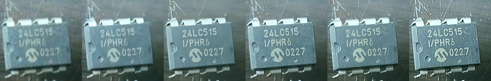
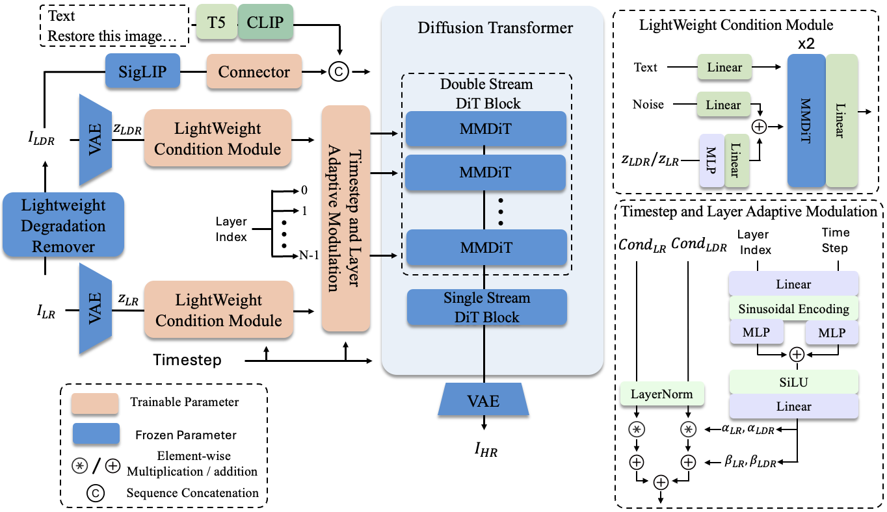

<div align="center">
<h1>🎨 LucidFlux:<br/>Caption-Free Photo-Realistic Image Restoration via a Large-Scale Diffusion Transformer</h1>

### [**🌐 Website**](https://w2genai-lab.github.io/LucidFlux/) | [**📘 Arxiv**](http://arxiv.org/abs/2509.22414) | [**🤗 Models**](https://huggingface.co/W2GenAI/LucidFlux) | [**🔧 Fal-AI Demo&API**](https://fal.ai/models/fal-ai/lucidflux/playground) 
</div>

---


---

<details open><summary>💡 We also have other projects on 4K text-to-image generation and RL-enhanced LucidFlux that may interest you. ✨</summary><p>

> [**[CVPR 2026] UltraFlux: Data-Model Co-Design for High-quality Native 4K Text-to-Image Generation across Diverse Aspect Ratios**](https://arxiv.org/pdf/2509.22414) <br>
> [**Tian Ye**](https://owen718.github.io/)<sup>1</sup>\*‡, [**Song Fei**](https://feisong123.github.io)<sup>1</sup>\*, [**Lei Zhu**](https://sites.google.com/site/indexlzhu/home)<sup>1,2</sup>† <br>
> [](https://github.com/W2GenAI-Lab/UltraFlux) [](https://github.com/W2GenAI-Lab/UltraFlux) [](https://arxiv.org/pdf/2509.22414) [](https://w2genai-lab.github.io/UltraFlux/) [](https://huggingface.co/Owen777/UltraFlux-v1) <br>

> [**LucidNFT: LR-Anchored Multi-Reward Preference Optimization for Generative Real-World Super-Resolution**](https://arxiv.org/pdf/2603.05947) <br>
> [**Song Fei**](https://feisong123.github.io)<sup>1,†</sup>, [**Tian Ye**](https://owen718.github.io)<sup>1,†</sup>, [**Sixiang Chen**](https://ephemeral182.github.io)<sup>1</sup>, [**Zhaohu Xing**](https://ge-xing.github.io)<sup>1</sup>, [**Jianyu Lai**](https://alexlai2860.github.io/)<sup>1</sup>, [**Lei Zhu**](https://sites.google.com/site/indexlzhu/home)<sup>1,2,*</sup> <br>
> [](https://github.com/W2GenAI-Lab/LucidNFT) [](https://github.com/W2GenAI-Lab/LucidNFT) [](https://arxiv.org/pdf/2603.05947) [](https://w2genai-lab.github.io/LucidNFT/) [](https://huggingface.co/W2GenAI/LucidNFT) <br>

</p></details>

---
## 📰 News & Updates  

**[2026.05.26]** - LucidFlux now integrates [PiD](https://github.com/nv-tlabs/PiD) to enable **4K image restoration**! 🚀

**[2026.03.19]** - We released the training code for LucidFlux.

**[2026.03.13]** - LucidFlux now integrates [UltraFlux](https://github.com/W2GenAI-Lab/UltraFlux)'s VAE to enable **2K image restoration**! 🚀

**[2026.03.10]** - We released the metadata for the clean images used in LucidFlux at [LucidFlux-Training-Data](https://huggingface.co/W2GenAI/LucidFlux/blob/main/LucidFlux-Training-Data.tar.gz) and the filtering pipeline in ```tools/filtering_pipeline.py```.

**[2026.02.06]** - LucidFlux is accepted by **ICLR'26**.

**[2025.10.07]** — Thanks to [smthemex](https://github.com/smthemex) for developing [ComfyUI_LucidFlux](https://github.com/smthemex/ComfyUI_LucidFlux), which enables LucidFlux to run with **as little as 8 GB–12 GB of memory** through the ComfyUI integration. 

**[2025.10.06]**  -- LucidFlux now supports **offload** and **precomputed prompt embeddings**, eliminating the need to load T5 or CLIP during inference. These improvements reduce memory usage significantly — inference can now run with **as little as 28 GB VRAM**, greatly enhancing deployment efficiency.  

**[2025.10.05]**  -- LucidFlux has been officially added to the **Fal AI Playground**! You can now try the **online demo** and access the **Fal API** directly here:  
👉 [**LucidFlux on Fal AI**](https://fal.ai/models/fal-ai/lucidflux/playground)  

---

Let us know if this works!

## 👥 Authors

> [**Song Fei**](https://feisong123.github.io)<sup>1</sup>\*, [**Tian Ye**](https://owen718.github.io/)<sup>1</sup>\*‡, [**Lujia Wang**](https://scholar.google.com/citations?user=c2_syKsAAAAJ)<sup>1</sup> , [**Lei Zhu**](https://sites.google.com/site/indexlzhu/home)<sup>1,2</sup>†
>
> <sup>1</sup>The Hong Kong University of Science and Technology (Guangzhou)  
> <sup>2</sup>The Hong Kong University of Science and Technology  
>
> \*Equal Contribution, ‡Project Leader, †Corresponding Author

---

## 🌟 What is LucidFlux?

LucidFlux is a caption-free universal image restoration framework that leverages a lightweight dual-branch conditioner and adaptive modulation to guide a large diffusion transformer (Flux.1) with minimal overhead, achieving robust, high-fidelity restoration without relying on text prompts or MLLM captions.

## 📊 Performance Benchmarks

<div align="center">

### 📈 Quantitative Results


</div>

---

## 🎭 Gallery & Examples

<div align="center">

### 🎨 LucidFlux Gallery

---

### 🔍 Comparison with Open-Source Methods

<table>
<tr align="center">
    <td width="200"><b>LQ</b></td>
    <td width="200"><b>SinSR</b></td>
    <td width="200"><b>SeeSR</b></td>
    <td width="200"><b>SUPIR</b></td>
    <td width="200"><b>DreamClear</b></td>
    <td width="200"><b>Ours</b></td>
</tr>
<tr align="center"><td colspan="6"></td></tr>
<tr align="center"><td colspan="6"></td></tr>
<tr align="center"><td colspan="6"></td></tr>
<tr align="center"><td colspan="6"></td></tr>
<tr align="center"><td colspan="6"></td></tr>
</table>

<details>
<summary>Show more examples</summary>

<table>
<tr align="center"><td colspan="6"></td></tr>
<tr align="center"><td colspan="6"></td></tr>
<tr align="center"><td colspan="6"></td></tr>
<tr align="center"><td colspan="6"></td></tr>
<tr align="center"><td colspan="6"></td></tr>
</table>

</details>

---

### 💼 Comparison with Commercial Models

<table>
<tr align="center">
    <td width="200"><b>LQ</b></td>
    <td width="200"><b>HYPIR-FLUX</b></td>
    <td width="200"><b>Topaz</b></td>
    <td width="200"><b>Seedream 4.0</b></td>
    <td width="200"><b>MeiTu SR</b></td>
    <td width="200"><b>Gemini-NanoBanana</b></td>
    <td width="200"><b>Ours</b></td>
</tr>
<tr align="center"><td colspan="7"></td></tr>
<tr align="center"><td colspan="7"></td></tr>
<tr align="center"><td colspan="7"></td></tr>
<tr align="center"><td colspan="7"></td></tr>
</table>

<details>
<summary>Show more examples</summary>

<table>
<tr align="center"><td colspan="7"></td></tr>
<tr align="center"><td colspan="7"></td></tr>
<tr align="center"><td colspan="7"></td></tr>
<tr align="center"><td colspan="7"></td></tr>
</table>

</details>
</div>

---

## 🏗️ Model Architecture

<div align="center">

<br>
<em><strong>Caption-Free Universal Image Restoration with a Large-Scale Diffusion Transformer</strong></em>
</div>

Our unified framework consists of **four critical components in the training workflow**:


**🎨 Dual-Branch Conditioner for Low-Quality Image Conditioning**

**🎯 Timestep and Layer-Adaptive Condition Injection**

**🔄 Semantic Priors from Siglip for Caption-Free Semantic Alignment**

**🔤 Scaling Up Real-world High-Quality Data for Universal Image Restoration**

## 🚀 Quick Start

> ⚠️ The default setup requires roughly 28 GB of GPU VRAM. 

### 🔧 Installation

```bash
# Clone the repository
git clone https://github.com/W2GenAI-Lab/LucidFlux.git
cd LucidFlux

# Create conda environment
conda create -n lucidflux python=3.11
conda activate lucidflux

# Install PyTorch (CUDA 12.8 wheels)
pip3 install torch torchvision torchaudio --index-url https://download.pytorch.org/whl/cu128

# Install remaining dependencies
pip install -r requirements.txt
```

### Inference

Prepare models in 2 steps, then run a single command.

1) Login to Hugging Face (required for gated FLUX.1-dev). Skip if already logged-in.

```bash
python -m tools.hf_login --token "$HF_TOKEN"
```

2) Download required weights to fixed paths and export env vars

```bash
# FLUX.1-dev (flow+ae), SwinIR prior, T5, CLIP, SigLIP and LucidFlux checkpoint to ./weights
python -m tools.download_weights --dest weights

# Exports FLUX_DEV_FLOW/FLUX_DEV_AE to your shell (Linux/macOS)
source weights/env.sh

# Windows: open `weights\env.sh`, replace each leading `export` with `set`, then paste those commands into Command Prompt
```


Run inference (uses fixed relative paths):

```bash
bash scripts/inference.sh
```

> ℹ️ LucidFlux builds on Flux-based generative priors. Restored images can differ from the low-quality input because the model removes degradations and hallucinates realistic details by design. Visual discrepancies are expected and indicate the generative nature of the method.

You can also obtain results of LucidFlux on RealSR and RealLQ250 from Hugging Face: [**LucidFlux**](https://huggingface.co/W2GenAI/LucidFlux).

### Data and Filtering Pipeline

We have released the metadata for the clean images used in LucidFlux at [LucidFlux-Training-Data](https://huggingface.co/W2GenAI/LucidFlux/blob/main/LucidFlux-Training-Data.tar.gz), and the filtering pipeline in ```tools/filtering_pipeline.py```. Images can be downloaded from the provided `image_url`, and filtering scores can be computed with:

```bash
# download the image
python tools/download_from_image_url.py "image_url in metadata"

# compute filtering scores
python tools/filtering_pipeline.py /path/to/image.jpg
```

The LSDIR dataset can be downloaded from [LSDIR](https://huggingface.co/ofsoundof/LSDIR), and degradation synthesis follows the pipeline from [Real-ESRGAN](https://github.com/xinntao/Real-ESRGAN). If more data is needed, please also refer to our [MultiAspect-4K-1M](https://github.com/W2GenAI-Lab/UltraFlux) dataset.

---

### Train

The training config is provided in `train_configs/train_LucidFlux.yaml`. The training data can be prepared in the same structure as the example under `assets/training_data`, where each sample is organized as paired images in `assets/training_data/lq` and `assets/training_data/gt`. In our current setup, the training run takes roughly 50 GB VRAM with `bs=2`, and about 43 GB with `bs=1`. Once the data is ready, you can start training with:

```bash
bash scripts/train.sh
```

## 🚀 Updates
For the purpose of fostering research and the open-source community, we plan to open-source the entire project, encompassing training, inference, weights, etc. Thank you for your patience and support! 🌟
- [x] Release github repo.
- [x] Release inference code.
- [x] Release model checkpoints.
- [x] Release arXiv paper.
- [x] Release training code.
- [x] Release the training data and filtering pipeline.


## 📝 Citation

If you find LucidFlux useful for your research, please cite our report:

```bibtex
@article{fei2025lucidflux,
  title={LucidFlux: Caption-Free Universal Image Restoration via a Large-Scale Diffusion Transformer},
  author={Fei, Song and Ye, Tian and Wang, Lujia and Zhu, Lei},
  journal={arXiv preprint arXiv:2509.22414},
  year={2025}
}
```
---

## 🪪 License

The provided code and pre-trained weights are licensed under the [FLUX.1 \[dev\]](LICENSE).

## 🙏 Acknowledgments

- This code is based on [FLUX](https://github.com/black-forest-labs/flux). Some code are brought from [DreamClear](https://github.com/shallowdream204/DreamClear), [x-flux](https://github.com/XLabs-AI/x-flux). We thank the authors for their awesome work.

- 🏛️ Thanks to our affiliated institutions for their support.
- 🤝 Special thanks to the open-source community for inspiration.

---

## 📬 Contact

For any questions or inquiries, please reach out to us:

- **Song Fei**: `sfei285@connect.hkust-gz.edu.cn`
- **Tian Ye**: `tye610@connect.hkust-gz.edu.cn`

## 🧑‍🤝‍🧑 WeChat Group
<details>
  <summary>点击展开二维码（WeChat Group QR Code）</summary>

  <br>

  

</details>

<details>
  <summary>如果群二维码过期，点击展开作者微信二维码（Author WeChat QR Code）</summary>

  <br>

  

</details>


</div>
