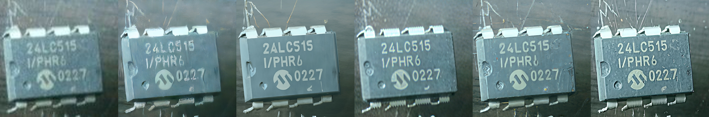

<div align="center">
<h1>🎨 LucidFlux:<br/>Caption-Free Universal Image Restoration with a Large-Scale Diffusion Transformer</h1>

<!-- [](https://github.com/W2GenAI-Lab/LucidFlux)
[](https://github.com/W2GenAI-Lab/LucidFlux)
[](https://github.com/W2GenAI-Lab/LucidFlux)
[](https://github.com/W2GenAI-Lab/LucidFlux)
[](https://github.com/W2GenAI-Lab/LucidFlux) -->

<!--  -->

### [**🌐 Website**](https://w2genai-lab.github.io/LucidFlux/) | [**📄 Technical Report**](Technical_Report.pdf) | [**🤗 Models**](https://github.com/W2GenAI-Lab/LucidFlux) 
<!-- | [**🤗 HF Demo**](https://github.com/W2GenAI-Lab/LucidFlux) -->
<!-- [**🎯 Demo**](https://github.com/W2GenAI-Lab/LucidFlux)  -->
</div>

---


---
## News & Updates


<!-- - 🖥️ **[2025.06]** We have pushed our work on [MeiGen-AI](https://github.com/MeiGen-AI), where you can explore not only our project but also the work of other colleagues. Feel free to check it out for more insights and contributions.
- 🧩 **[2025.06]** Community user [@AIFSH](https://github.com/AIFSH) has successfully integrated **LucidFlux into ComfyUI**!  
  You can check out the full workflow here: [LucidFlux-ComfyUI Example](https://www.xiangongyun.com/image/detail/68b711eb-a31e-47db-82eb-47438359f4bf?r=XLVYLW)  
  Big thanks to the contributor — this will be helpful for many users! See [Issue #6](https://github.com/Ephemeral182/LucidFlux/issues/6) for details.
- 📖 **[2025.06]** Our **Chinese article** providing a detailed introduction and technical walkthrough of LucidFlux is now available!  
Read it here: [中文解读｜高质量美学海报生成框架 LucidFlux](https://mp.weixin.qq.com/s/gq6DwohKP0z333OSDRe7Xw)
- 🔥 **[2025.06]** We have deployed a demo on Hugging Face Space, feel free to give it a try!
- 🚀 **[2025.06]** Our gradio demo and inference code are now available!
- 📊 **[2025.06]** We have released partial datasets and model weights on HuggingFace. -->

---

Let us know if this works!

## 👥 Authors

> [**Song Fei**](https://github.com/FeiSong123)<sup>1</sup>\*, [**Tian Ye**](https://owen718.github.io/)<sup>1</sup>\*‡, [**Lei Zhu**](https://sites.google.com/site/indexlzhu/home)<sup>1,2</sup>†
>
> <sup>1</sup>The Hong Kong University of Science and Technology (Guangzhou)  
> <sup>2</sup>The Hong Kong University of Science and Technology  
>
> \*Equal Contribution, ‡Project Leader, †Corresponding Author

---

## 🌟 What is LucidFlux?

<!-- <div align="center">

<br>
</div> -->

LucidFlux is a framework designed to perform high-fidelity image restoration across a wide range of degradations without requiring textual captions. By combining a Flux-based DiT backbone with dual ControlNet branches and SigLIP semantic alignment, LucidFlux enables caption-free guidance while preserving structural and semantic consistency, achieving superior restoration quality.

<!-- ## 🚀 Quick Start

### 🔧 Installation

```bash
# Clone the repository
git clone https://github.com/ephemeral182/LucidFlux.git
cd LucidFlux

# Create conda environment
conda create -n postercraft python=3.11
conda activate postercraft

# Install dependencies
pip install -r requirements.txt

``` -->

<!-- ### 🚀 Quick Generation

Generate high-quality aesthetic posters from your prompt with `BF16` precision:

```bash
python inference.py \
  --prompt "Urban Canvas Street Art Expo poster with bold graffiti-style lettering and dynamic colorful splashes" \
  --enable_recap \
  --num_inference_steps 28 \
  --guidance_scale 3.5 \
  --seed 42 \
  --pipeline_path "black-forest-labs/FLUX.1-dev" \
  --custom_transformer_path "LucidFlux/LucidFlux-v1_RL" \
  --qwen_model_path "Qwen/Qwen3-8B"
```

If you are running on a GPU with limited memory, you can use `inference_offload.py` to offload some components to the CPU:

```bash
python inference_offload.py \
  --prompt "Urban Canvas Street Art Expo poster with bold graffiti-style lettering and dynamic colorful splashes" \
  --enable_recap \
  --num_inference_steps 28 \
  --guidance_scale 3.5 \
  --seed 42 \
  --pipeline_path "black-forest-labs/FLUX.1-dev" \
  --custom_transformer_path "LucidFlux/LucidFlux-v1_RL" \
  --qwen_model_path "Qwen/Qwen3-8B"
``` -->
<!-- 
### 💻 Gradio Web UI

We provide a Gradio web UI for LucidFlux. 

```bash
python demo_gradio.py
``` -->


## 📊 Performance Benchmarks

<div align="center">

### 📈 Quantitative Results

<table>
<thead>
  <tr>
    <th>Benchmark</th>
    <th>Metric</th>
    <th>ResShift</th>
    <th>StableSR</th>
    <th>SinSR</th>
    <th>SeeSR</th>
    <th>DreamClear</th>
    <th>SUPIR</th>
    <th>LucidFlux<br/>(Ours)</th>
  </tr>
</thead>
<tbody>
  <tr>
    <td rowspan="7" style="text-align:center; vertical-align:middle;">RealSR</td>
    <td style="white-space: nowrap;">CLIP-IQA+ ↑</td>
    <td>0.5005</td>
    <td>0.4408</td>
    <td>0.5416</td>
    <td>0.6731</td>
    <td>0.5331</td>
    <td>0.5640</td>
    <td><b>0.7074</b></td>
  </tr>
  <tr>
    <td style="white-space: nowrap;">Q-Align ↑</td>
    <td>3.1045</td>
    <td>2.5087</td>
    <td>3.3615</td>
    <td>3.6073</td>
    <td>3.0044</td>
    <td>3.4682</td>
    <td><b>3.7555</b></td>
  </tr>
  <tr>
    <td style="white-space: nowrap;">MUSIQ ↑</td>
    <td>49.50</td>
    <td>39.98</td>
    <td>57.95</td>
    <td>67.57</td>
    <td>49.48</td>
    <td>55.68</td>
    <td><b>70.20</b></td>
  </tr>
  <tr>
    <td style="white-space: nowrap;">MANIQA ↑</td>
    <td>0.2976</td>
    <td>0.2356</td>
    <td>0.3753</td>
    <td>0.5087</td>
    <td>0.3092</td>
    <td>0.3426</td>
    <td><b>0.5437</b></td>
  </tr>
  <tr>
    <td style="white-space: nowrap;">NIMA ↑</td>
    <td>4.7026</td>
    <td>4.3639</td>
    <td>4.8282</td>
    <td>4.8957</td>
    <td>4.4948</td>
    <td>4.6401</td>
    <td><b>5.1072</b></td>
  </tr>
  <tr>
    <td style="white-space: nowrap;">CLIP-IQA ↑</td>
    <td>0.5283</td>
    <td>0.3521</td>
    <td>0.6601</td>
    <td><b>0.6993</b></td>
    <td>0.5390</td>
    <td>0.4857</td>
    <td>0.6783</td>
  </tr>
  <tr>
    <td style="white-space: nowrap;">NIQE ↓</td>
    <td>9.0674</td>
    <td>6.8733</td>
    <td>6.4682</td>
    <td>5.4594</td>
    <td>5.2873</td>
    <td>5.2819</td>
    <td><b>4.2893</b></td>
  </tr>
  <tr>
    <td rowspan="7" style="text-align:center; vertical-align:middle;">RealLQ250</td>
    <td style="white-space: nowrap;">CLIP-IQA+ ↑</td>
    <td>0.5529</td>
    <td>0.5804</td>
    <td>0.6054</td>
    <td>0.7034</td>
    <td>0.6810</td>
    <td>0.6532</td>
    <td><b>0.7406</b></td>
  </tr>
  <tr>
    <td style="white-space: nowrap;">Q-Align ↑</td>
    <td>3.6318</td>
    <td>3.5586</td>
    <td>3.7451</td>
    <td>4.1423</td>
    <td>4.0640</td>
    <td>4.1347</td>
    <td><b>4.3935</b></td>
  </tr>
  <tr>
    <td style="white-space: nowrap;">MUSIQ ↑</td>
    <td>59.50</td>
    <td>57.25</td>
    <td>65.45</td>
    <td>70.38</td>
    <td>67.08</td>
    <td>65.81</td>
    <td><b>73.01</b></td>
  </tr>
  <tr>
    <td style="white-space: nowrap;">MANIQA ↑</td>
    <td>0.3397</td>
    <td>0.2937</td>
    <td>0.4230</td>
    <td>0.4895</td>
    <td>0.4400</td>
    <td>0.3826</td>
    <td><b>0.5589</b></td>
  </tr>
  <tr>
    <td style="white-space: nowrap;">NIMA ↑</td>
    <td>5.0624</td>
    <td>5.0538</td>
    <td>5.2397</td>
    <td>5.3146</td>
    <td>5.2200</td>
    <td>5.0806</td>
    <td><b>5.4836</b></td>
  </tr>
  <tr>
    <td style="white-space: nowrap;">CLIP-IQA ↑</td>
    <td>0.6129</td>
    <td>0.5160</td>
    <td><b>0.7166</b></td>
    <td>0.7063</td>
    <td>0.6950</td>
    <td>0.5767</td>
    <td>0.7122</td>
  </tr>
  <tr>
    <td style="white-space: nowrap;">NIQE ↓</td>
    <td>6.6326</td>
    <td>4.6236</td>
    <td>5.4425</td>
    <td>4.4383</td>
    <td>3.8700</td>
    <td><b>3.6591</b></td>
    <td>3.6742</td>
  </tr>
</tbody>
</table>


<!--  -->

</div>

---

## 🎭 Gallery & Examples

<div align="center">

### 🎨 LucidFlux Gallery

<table>
<tr align="center">
    <td width="200"><b>LQ</b></td>
    <td width="200"><b>SinSR</b></td>
    <td width="200"><b>SeeSR</b></td>
    <td width="200"><b>SUPIR</b></td>
    <td width="200"><b>DreamClear</b></td>
    <td width="200"><b>Ours</b></td>
</tr>
<tr align="center"><td colspan="6"></td></tr>
<tr align="center"><td colspan="6"></td></tr>
<tr align="center"><td colspan="6"></td></tr>
<tr align="center"><td colspan="6"></td></tr>
<tr align="center"><td colspan="6"></td></tr>
</table>

<details>
<summary>Show more examples</summary>

<table>
<tr align="center"><td colspan="6"></td></tr>
<tr align="center"><td colspan="6"></td></tr>
<tr align="center"><td colspan="6"></td></tr>
<tr align="center"><td colspan="6"></td></tr>
<tr align="center"><td colspan="6"></td></tr>
</table>

</details>
</div>
<!-- 
## 🎭 Gallery & Examples

<div align="center">

### 🎨 LucidFlux Gallery

<table>
<tr align="center">
    <td width="200"><b>LQ</b></td>
    <td width="200"><b>SeeSR</b></td>
    <td width="200"><b>SUPIR</b></td>
    <td width="200"><b>DreamClear</b></td>
    <td width="200"><b>Ours</b></td>
</tr>
<tr align="center"><td colspan="6"></td></tr>
<tr align="center"><td colspan="6"></td></tr>
<tr align="center"><td colspan="6"></td></tr>
<tr align="center"><td colspan="6"></td></tr>
<tr align="center"><td colspan="6"></td></tr>
<tr align="center"><td colspan="6"></td></tr>
<tr align="center"><td colspan="6"></td></tr>
<tr align="center"><td colspan="6"></td></tr>
<tr align="center"><td colspan="6"></td></tr>
<tr align="center"><td colspan="6"></td></tr>
<tr align="center"><td colspan="6"></td></tr>
<tr align="center"><td colspan="6"></td></tr>
<tr align="center"><td colspan="6"></td></tr>
<tr align="center"><td colspan="6"></td></tr>
<tr align="center"><td colspan="6"></td></tr>
<tr align="center"><td colspan="6"></td></tr>
<tr align="center"><td colspan="6"></td></tr>
<tr align="center"><td colspan="6"></td></tr>
<tr align="center"><td colspan="6"></td></tr>
<tr align="center"><td colspan="6"></td></tr>
<tr align="center"><td colspan="6"></td></tr>
<tr align="center"><td colspan="6"></td></tr>
<tr align="center"><td colspan="6"></td></tr>
</table>

</div> -->

---

## 🏗️ Model Architecture

<div align="center">

<br>
<em><strong>Caption-Free Universal Image Restoration with a Large-Scale Diffusion Transformer</strong></em>
</div>

Our unified framework consists of **four critical components in the training workflow**:

### 🔤 Scaling Up Real-world High-Quality Data for Universal Image Restoration
Existing restoration datasets are too small to support large diffusion models. To address this, we build a large-scale high-quality dataset through a three-stage automatic filtering pipeline (blur, flat-region, and IQA), selecting 342K images from 2.95M candidates. Using Real-ESRGAN, we further synthesize 1.37M paired samples, ensuring diverse and realistic degradations for effective training.

### 🎨 Two Parallel ControlNet Branches for Low-Quality Image Conditioning 
Flux.1 was not built for restoration, and existing ControlNet strategies either leave artifacts or oversmooth details. We follow DreamClear with a dual-branch design: one branch uses the raw LQ image to keep textures, while the other applies lightweight degradation removal. Together, they balance artifact removal and detail preservation for better restoration.

### 🎯 Timestep and Layer-Adaptive Condition Injection
In diffusion models, early timesteps mainly capture global structures, while later ones enrich fine details. A similar hierarchy exists within DiT layers: shallow layers tend to model coarse, low-frequency patterns, whereas deeper layers refine high-frequency textures. Injecting identical conditions across all layers neglects this distinction. To address this, we design a timestep- and layer-adaptive modulation strategy, where ControlNet features are injected in accordance with both the current timestep and the target layer. This dynamic conditioning better aligns with the coarse-to-fine restoration process, leading to more effective detail recovery.

### 🔄 SigLIP-Redux for Caption-Free Semantic Alignment
Text-to-image (T2I) diffusion models are designed to generate images from text, and prior works often use captions during training and inference to guide restoration. However, training captions come from clean images, which are unavailable in real world scenario, and captions generated from degraded inputs may describe the degradation itself, misleading the model. To overcome this, we extract semantic features directly from the low-quality input using SigLIP and align them with the DiT feature space via a learnable connector, providing robust caption-free semantic guidance for high-fidelity restoration.


## 🚀 Quick Start

### 🔧 Installation

```bash
# Clone the repository
git clone https://github.com/W2GenAI-Lab/LucidFlux.git
cd LucidFlux

# Create conda environment
conda create -n lucidflux python=3.9
conda activate lucidflux

# Install dependencies
pip install -r requirements.txt

```

### Inference
- **Flux.1 dev** → [🤗 FLUX.1-dev](https://huggingface.co/black-forest-labs/FLUX.1-dev)  
  Then update the flux path in `src/flux/util.py` to your local flux path.

- **SigLIP** → [🤗 siglip2-so400m-patch16-512](https://huggingface.co/google/siglip2-so400m-patch16-512)  
  Then set `siglip_ckpt` to the corresponding local path.

- **SwinIR** → [🤗 SwinIR](https://huggingface.co/lxq007/DiffBIR/blob/main/general_swinir_v1.ckpt)  
  Then set `swin_ir_ckpt` to the corresponding local path.

- **LucidFlux** → [🤗 LucidFlux](https://huggingface.co/W2GenAI/LucidFlux)  
  Then set `checkpoint` to the corresponding local path.

```bash 
inference.sh

result_dir=ouput_images_folder
input_folder=input_images_folder
checkpoint_path=path/to/lucidflux.pth
swin_ir_ckpt=path/to/swinir.ckpt
siglip_ckpt=path/to/siglip.ckpt

mkdir -p ${result_dir}
echo "Processing checkpoint..."
python inference.py \
  --checkpoint ${checkpoint_path} \
  --swinir_pretrained ${swin_ir_ckpt} \
  --control_image ${input_folder} \
  --siglip_ckpt ${siglip_ckpt} \
  --prompt "restore this image into high-quality, clean, high-resolution result" \
  --output_dir ${result_dir}/ \
  --width 1024 --height 1024 --num_steps 50 \
```

Finially ```bash inference.sh```. You can also obtain the results of LucidFlux on RealSR and RealLQ250 from Hugging Face: [**LucidFlux**](https://huggingface.co/W2GenAI/LucidFlux).

## 🪪 License

The provided code and pre-trained weights are licensed under the [FLUX.1 [dev]](LICENSE).

## 🙏 Acknowledgments

- This code is based on [FLUX](https://github.com/black-forest-labs/flux). Some code are brought from [DreamClear](https://github.com/shallowdream204/DreamClear). We thank the authors for their awesome work.

- 🏛️ Thanks to our affiliated institutions for their support.
- 🤝 Special thanks to the open-source community for inspiration.

---

## 📬 Contact

For any questions or inquiries, please reach out to us:

- **Song Fei**: `sfei285@connect.hkust-gz.edu.cn`
- **Tian Ye**: `tye610@connect.hkust-gz.edu.cn`

## 🧑‍🤝‍🧑 WeChat Group
<details>
  <summary>点击展开二维码（WeChat Group QR Code）</summary>

  <br>

  
</details>


</div>
